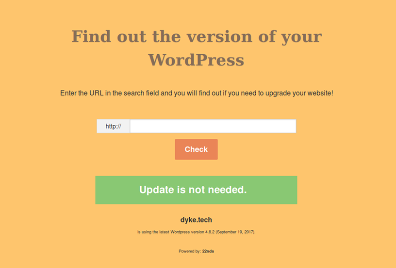

## WordPress Version Checker

### Results page

Works as a page where you enter the URL and it returns it's version.

# History
Code first launched on a live site in September 2014. The new versions were added upon their release. Currently the page is offline, but the code is still available on GitHub.